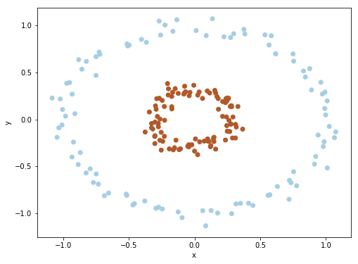

```python
# 遇到bug，首先考虑代码问题，然后考虑算法问题
# sklearn datasets and related functions
import matplotlib.pyplot as plt
from mpl_toolkits.mplot3d import Axes3D

# different functions in 3d plot
from sklearn.datasets import make_gaussian_quantiles

from sklearn.datasets import make_circles

fig = plt.figure(1, figsize=(8, 6))
ax = Axes3D(fig, elev=-150, azim=110) # elev, azim 表示选择观看的角度
# n_feature indicate data dimension, n_classes indicate labels
X, Y = make_gaussian_quantiles(n_samples=200, n_features=10, n_classes=3) 
ax.scatter(X[:, 0], X[:, 1], X[:, 2], c=Y, cmap=plt.cm.Paired) # cmap use different(nicer) colors

plt.show()
```


```python
from sklearn.datasets import make_circles

X, Y = make_circles(n_samples=200, factor=.3, noise=.05) # factor gap between inner and outer

plt.figure(figsize=(8, 6))
plt.clf()
plt.scatter(X[:, 0], X[:, 1], c=Y, cmap=plt.cm.Paired)
plt.xlabel('x')
plt.ylabel('y')

plt.show()
```





```python
from sklearn import datasets
iris = datasets.load_iris()
X = iris.data[:, :2] # iris have four features, choose first two features here
Y = iris.target # Y indicate data labels

plt.figure(1, figsize=(8, 6))
plt.clf()
plt.scatter(X[:, 0], X[:, 1], c=Y, cmap=plt.cm.Paired)
plt.xlabel('length')
plt.ylabel('width')

plt.show()
```


```python
# numpy linear algbera library
# vector/matrix norm distance, argsort function...

import numpy as np
from numpy import linalg as LA

a = np.array([1, 2, 4, 6])
matrix = np.array([[1,2,3],
                   [2,3,4],
                   [3,4,5]])
# calcuate vector a l1-norm distance
l1_norm = LA.norm(a, 1)
print("l1_norm distance: ", l1_norm)

# calcuate vector a Euclidean distance, by default
l2_norm = LA.norm(a)
print("l2_norm distance: ", l2_norm)

# eigenvectors decompose
w, v = LA.eig(matrix)
print("eigenvalues: ", w)
print("eigenvectors: ", v)

# sort vector by index
n = 2
# from small to large, choose first n values
index = np.argsort(w)[:n]
# from large to small, choose first n values
index = np.argsort(w)[::-1][:n]
print("argsort: ", index)
```

    l1_norm distance:  13.0
    l2_norm distance:  7.54983443527
    eigenvalues:  [  9.62347538e+00  -6.23475383e-01   9.06797114e-17]
    eigenvectors:  [[-0.38508979 -0.82767094  0.40824829]
     [-0.55951021 -0.14241368 -0.81649658]
     [-0.73393063  0.54284358  0.40824829]]
    argsort:  [0 2]


```python

```
